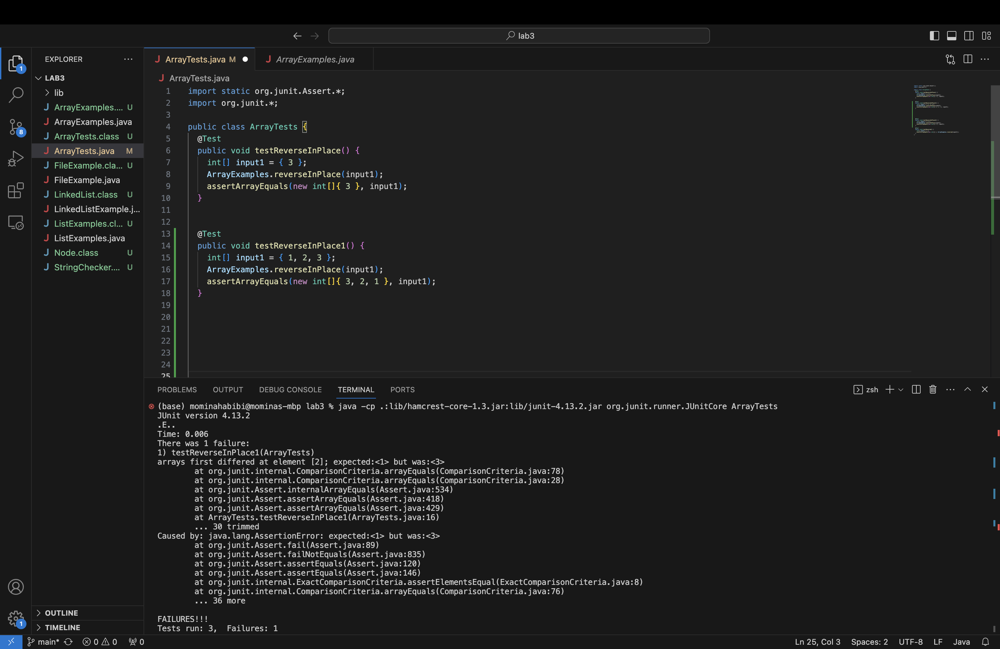
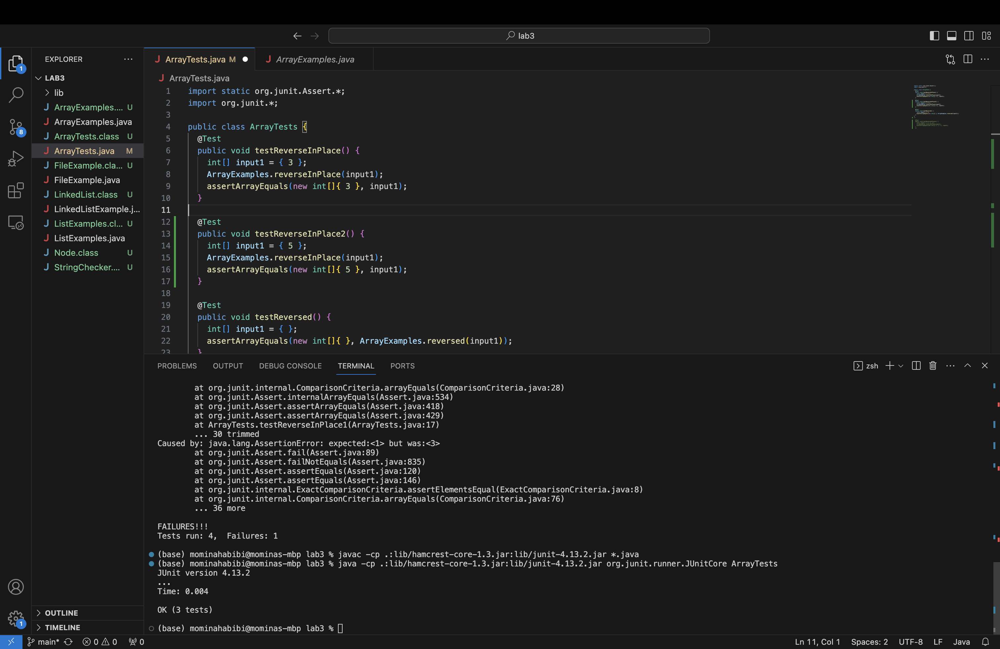

# **Lab Report 3 - Bugs and Commands**
*By Momina Habibi*

# Part 1 - Bugs
- The failure-inducing input
```
@Test
  public void testReverseInPlace1() {
    int[] input1 = { 1, 2, 3 };
    ArrayExamples.reverseInPlace(input1);
    assertArrayEquals(new int[]{ 3, 2, 1 }, input1);
	}
```
- The input that doesn't induce a failure
  ```
  @Test 
	public void testReverseInPlace2() {
    int[] input1 = { 5 };
    ArrayExamples.reverseInPlace(input1);
    assertArrayEquals(new int[]{ 5 }, input1);
	}
  ```
- The symptom as the output of running the tests

  This is the screenshot for the failure-inducing input
  
  
  This is the screenshot for the input that doesn't induce a failure 
  
  
- The code with the bug 

```
 static void reverseInPlace(int[] arr) {
    for(int i = 0; i < arr.length; i += 1) {
      arr[i] = arr[arr.length - i - 1];
    }
  }
```

- The code without the bug  

  ```
   static void reverseInPlace(int[] arr) {
    for(int i = 0; i < arr.length/2; i += 1) {
      int temp = arr[i];
      arr[i] = arr[arr.length - i - 1];
       arr[arr.length-i-1] = temp;
    }
  }
  ```
- The fix addresses the issue by correctly reversing the elements in the input array through a swapping. first, I changed the parameter in the for loop to i < arr.length/2 then I created a temp variable to save the original value of the element at index `i` then  I swapped the current element at index `i` with the element at the corresponding position from the end of the array then I assign the element from the end of the array with the value stored in the temp variable which contains the original value of the element at index `i`. By doing this approach, the fix ensures that the input array is reversed in place and does correctly for arrays of any length.


# Part 2 - Researching Commands
I chose the command grep because it is a very useful command for searching text patterns within files. 

- First alternate way of using command grep with -iw
Example 1:
```
(base) mominahabibi@Mominas-MBP docsearch % grep -iw war ./technical/911report/chapter-1.txt
    The threat of Soviet bombers diminished significantly as the Cold War ended, and the number of NORAD alert sites was reduced from its Cold War high of 26. Some within the Pentagon argued in the 1990s that the alert sites should be eliminated entirely. In an effort to preserve their mission, members of the air defense community advocated the importance of air sovereignty against emerging "asymmetric threats" to the United States: drug smuggling, "non-state and state-sponsored terrorists," and the proliferation of weapons of mass destruction and ballistic missile technology.
    The President's motorcade departed at 9:35, and arrived at the airport between 9:42 and 9:45. During the ride the President learned about the attack on the Pentagon. He boarded the aircraft, asked the Secret Service about the safety of his family, and called the Vice President. According to notes of the call, at about 9:45 the President told the Vice President:"Sounds like we have a minor war going on here, I heard about the Pentagon. We're at war . . . somebody's going to pay."
    At 10:02 that morning, an assistant to the mission crew commander at NORAD's Northeast Air Defense Sector in Rome, New York, was working with his colleagues on the floor of the command center. In a brief moment of reflection, he was recorded remarking that "This is a new type of war."
(base) mominahabibi@Mominas-MBP docsearch % 
```
Example 2:
```
(base) mominahabibi@Mominas-MBP docsearch % grep -iw niaaa ./technical/government/*/*2-PDF.txt
Institute on Alcohol Abuse and Alcoholism (NIAAA) defines at-risk
In addition to these questionnaires, NIAAA suggests that all
recommended using the NIAAA approach in the ED.10
recommended by NIAAA for primary care should be compared with other
sequences. Several trials of variations of the NIAAA approach are
be evaluated by studying the NIAAA approach and several
(base) mominahabibi@Mominas-MBP docsearch % 

```
Using command `grep` with `[-iw word]` so the `-i` (ignore case) makes grep case insensitive and `-w` (word-regexp) ensures that grep matches only whole words. It is so useful for the time that we want to find the whole word regardless of whether the characters are in uppercase or lowercase.  

- Second alternate way of using the command grep with 
Example 1:
```
code
```
Example 2:
```
code
```

- Third alternate way of using the command grep with 
Example 1:
```
code
```
Example 2:
```
code
```

- Fourth alternate way of using the command grep with 
Example 1:
```
code
```
Example 2:
```
code
```

https://www.youtube.com/watch?v=N05sWPgj-44
